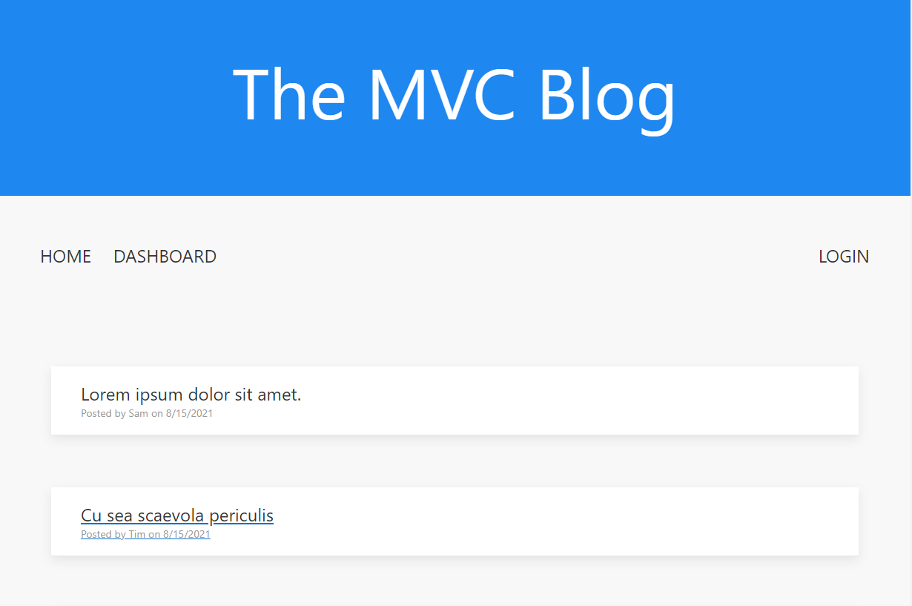
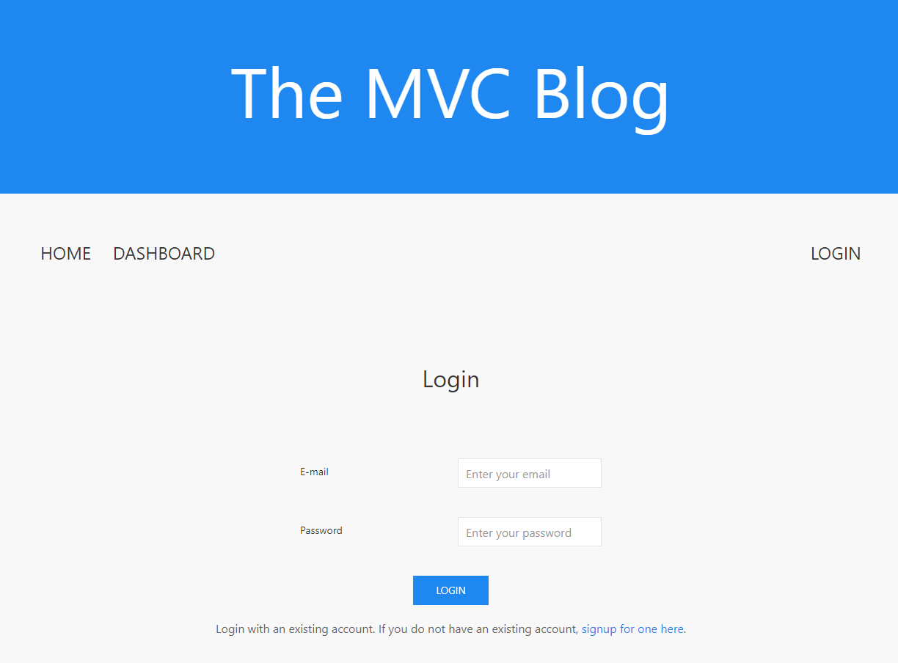
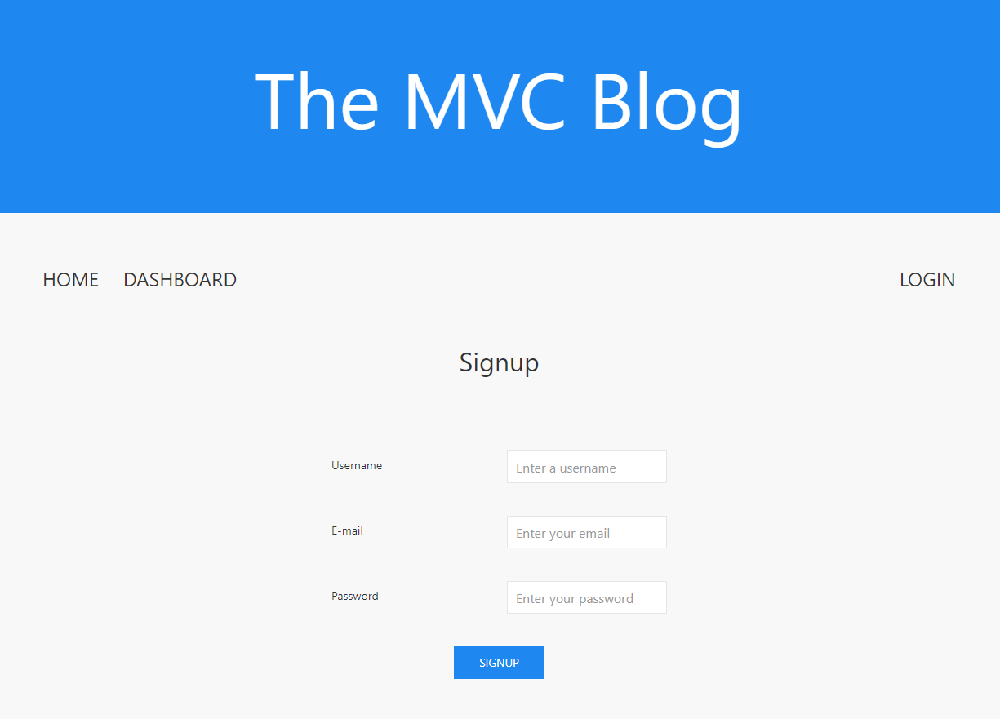
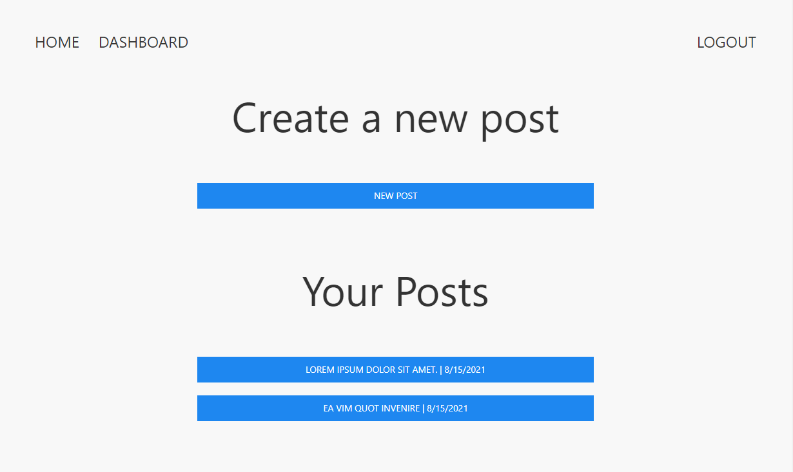
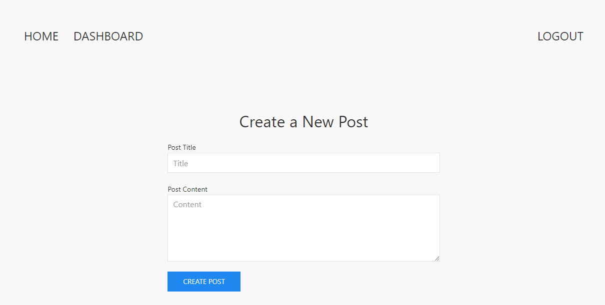
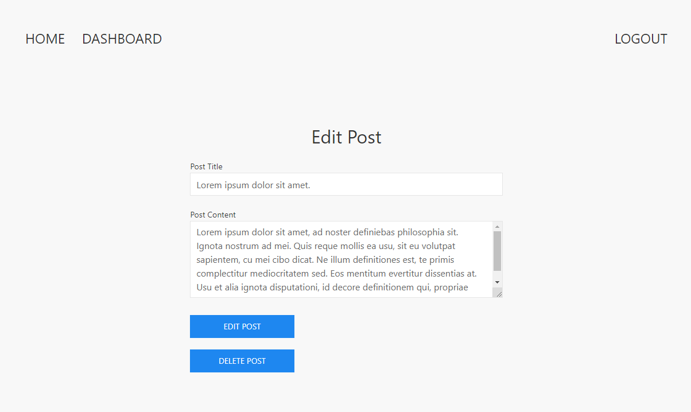
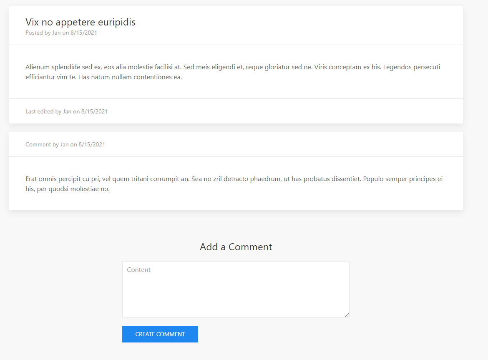

# MVC Blog

## Description

MVC Blog is a fullstack CMS-style blog application that follows the Model-View-Controller structure. Users can create accounts in order to create and edit blog posts. They can also comment on other user's blog posts. Users that are not signed-up or logged in can view blog posts and comments, but cannot create their own posts or comments. Users that are logged in, but inactive for 5 minutes or more, will be automatically logged out.

[Deployed Application](https://mvc-blog-spreston4.herokuapp.com/)

[GitHub Repo](https://github.com/spreston4/mvc-blog)

## Technologies Used

Built in Visual Studio with:
* Node.js
* JavaScript / jQuery
* Express
* Express-Sessions
* Handlebars
* MySQL
* Sequelize
* bcrypt


## How To

When the application loads, the user is presented with the home page. From the homepage, the user can view the nav bar and the titles of existing blog posts. Clicking the title of an existing blog post will allow the user to view the post contents and any comments on the post. Before the user logs in, selecting 'Dashboard' or 'Login' will direct the user to the login page.



Selecting 'Login' will direct the user to the login page where they can sign in with existing credentials. If the user does not have an existing account they can select the option to create a new account by clicking the link below the login form.





Once logged in, users can view their dashboard. From the dashboard users have the option to create a new post, or edit an existing post. Users can also delte posts from the edit post page.







All users can view posts and post comments by click a post title from the home page. However, only users that are logged in will have the option to add a comment.




## User Story

```md
AS A developer who writes about tech
I WANT a CMS-style blog site
SO THAT I can publish articles, blog posts, and my thoughts and opinions
```

## Acceptance Criteria

```md
GIVEN a CMS-style blog site
WHEN I visit the site for the first time
THEN I am presented with the homepage, which includes existing blog posts if any have been posted; navigation links for the homepage and the dashboard; and the option to log in
WHEN I click on the homepage option
THEN I am taken to the homepage
WHEN I click on any other links in the navigation
THEN I am prompted to either sign up or sign in
WHEN I choose to sign up
THEN I am prompted to create a username and password
WHEN I click on the sign-up button
THEN my user credentials are saved and I am logged into the site
WHEN I revisit the site at a later time and choose to sign in
THEN I am prompted to enter my username and password
WHEN I am signed in to the site
THEN I see navigation links for the homepage, the dashboard, and the option to log out
WHEN I click on the homepage option in the navigation
THEN I am taken to the homepage and presented with existing blog posts that include the post title and the date created
WHEN I click on an existing blog post
THEN I am presented with the post title, contents, post creator’s username, and date created for that post and have the option to leave a comment
WHEN I enter a comment and click on the submit button while signed in
THEN the comment is saved and the post is updated to display the comment, the comment creator’s username, and the date created
WHEN I click on the dashboard option in the navigation
THEN I am taken to the dashboard and presented with any blog posts I have already created and the option to add a new blog post
WHEN I click on the button to add a new blog post
THEN I am prompted to enter both a title and contents for my blog post
WHEN I click on the button to create a new blog post
THEN the title and contents of my post are saved and I am taken back to an updated dashboard with my new blog post
WHEN I click on one of my existing posts in the dashboard
THEN I am able to delete or update my post and taken back to an updated dashboard
WHEN I click on the logout option in the navigation
THEN I am signed out of the site
WHEN I am idle on the site for more than a set time
THEN I am able to view comments but I am prompted to log in again before I can add, update, or delete comments
```

## Contact Me

Contact me via e-mail, or check out my GitHub!

* GitHub: [spreston4](https://github.com/spreston4)
* E-mail: [sam.preston11@gmail.com](mailto:sam.preston11@gmail.com)

